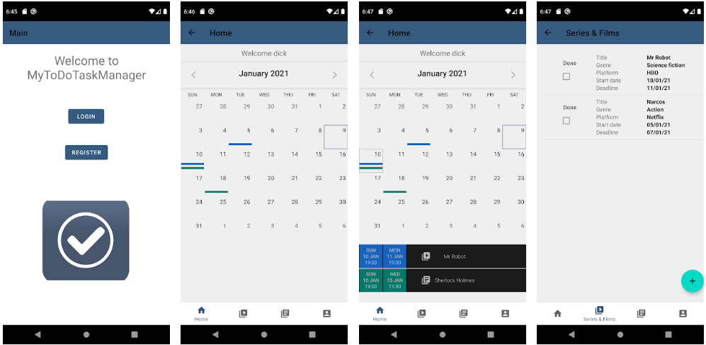

<h1 align="center">MyTodoTaskManager</h1>

  
   

MyTodoTaskManager is a application to remind a user different kinds of tasks like watch series, movies and read books.

Android Application developed with Kotlin, Clean architecture, MVVM pattern, Koin, Coroutines, Retrofit, Room, JWT and MockK for testing.

## Download
Currently available on the Play store.

Go to [Releases](https://github.com/Steampunk1453/todo-task-manager-android/releases) to download the latest version.

## Screenshots

## Technical details
MyTodoTaskManager is based on MVVM and Repository patterns.

The app uses coroutines and Room database as local cache to avoid API calls.

The API (Back-end) URL is deployed on Heroku: [todo-task-manager-heroku](https://pers-task-manager.herokuapp.com)

You can find the API project in: [todo-task-manager-github](https://github.com/Steampunk1453/todo-task-manager)

## Tech stack
- Minimum SDK level 21
- [Kotlin](https://kotlinlang.org/) based + [Coroutines](https://github.com/Kotlin/kotlinx.coroutines) for asynchronous.
- JetPack
  - LiveData - notify domain layer data to views.
  - Lifecycle - dispose of observing data when lifecycle state changes.
  - ViewModel - UI related data holder, lifecycle aware.
  - Room Persistence - construct a database using the abstract layer.
- Architecture
  - MVVM (View - DataBinding - ViewModel - Model)
  - Repository pattern
  - [Koin](https://github.com/InsertKoinIO/koin) - dependency injection.
- [Retrofit2 & Gson](https://github.com/square/retrofit) - construct the REST APIs.
- [OkHttp3](https://github.com/square/okhttp) - implementing interceptor, logging and mocking web server.
- [Timber](https://github.com/JakeWharton/timber) - logging.
- [Material-Components](https://github.com/material-components/material-components-android) - Material design components for views.

## Unit Testing Frameworks
Unit Tests verify the interactions of use cases between repositories and dao & REST api requests.
- [JUnit](https://github.com/junit-team/junit5) - a programmer oriented testing framework.
- [MockK](https://github.com/mockk/mockkn) - a mocking library for Kotlin.

## Local environment
- You can test the application running it in local, this is the default API server:

          buildConfigField "String", "SERVER_URL", '"https://pers-task-manager.herokuapp.com/api/"'

- Also, you can run API project in local, following:

     [Readme todo-task-manager](https://github.com/Steampunk1453/todo-task-manager/blob/master/README.md#local-environment)

- In the app file build.gradle you have to add:

    - If you use emulator

            buildConfigField "String", "SERVER_URL", '"http://10.0.2.2:8080/api/"'

    - If you use your phone

            buildConfigField "String", "SERVER_URL", '"http://[your local IP address]:8080/api/"'
 

